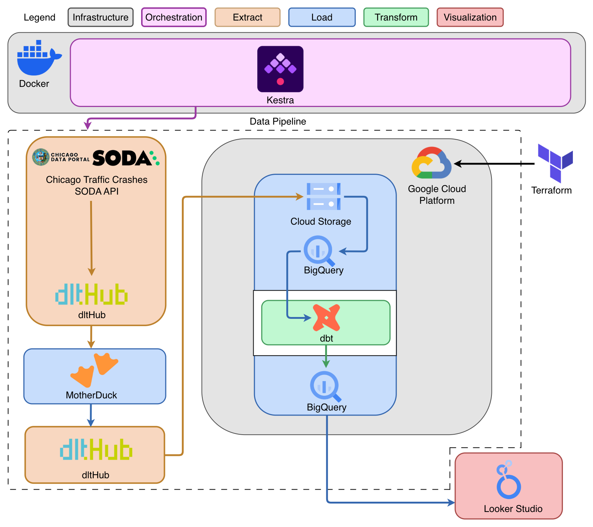
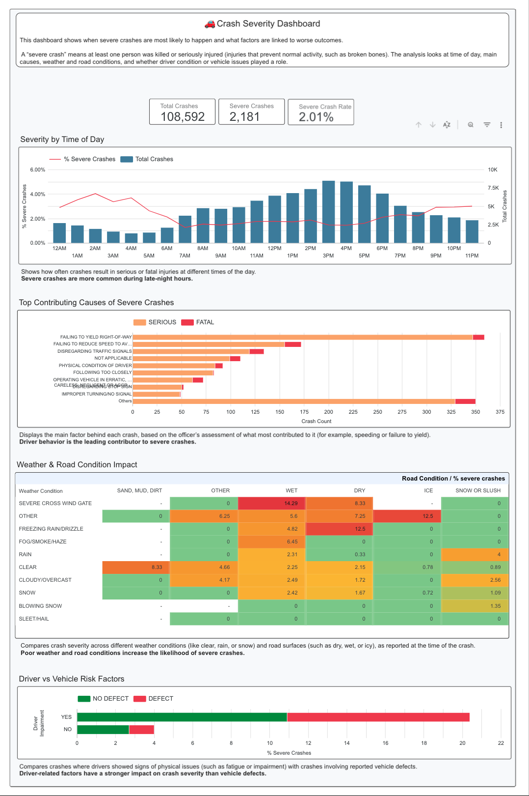

# 🚦 Chicago Traffic Crashes

> End-to-end data engineering pipeline for analyzing traffic crash severity across Chicago — from raw API data to an interactive Looker Studio dashboard.

## Table of Contents

- [Overview](#overview)
- [Problem Statement](#problem-statement)
- [Infrastructure](#infrastructure)
- [Architecture](#architecture)
- [Dashboard](#dashboard)
- [Setup and Installation](#setup-and-installation)
- [Challenges and Learnings](#challenges-and-learnings)
- [Future Improvements](#future-improvements)

## Overview

This project, developed as the final submission for the **DE Zoomcamp 2026 cohort**, builds an end-to-end batch data pipeline to process and analyze traffic crash data from the City of Chicago. The pipeline ingests raw crash records daily from the [Chicago Data Portal](https://data.cityofchicago.org) via the SODA 2.0 API, stages them in MotherDuck, stores them in a data lake on Google Cloud Storage as partitioned Parquet files, transforms them in BigQuery using dbt, and visualizes key insights through a Looker Studio dashboard. The pipeline is orchestrated with Kestra and Google Cloud infrastructure is provisioned with Terraform.

The MotherDuck staging step is not strictly necessary, but was intentionally included to practice working with multiple tools across different stages of a pipeline.

### Problem Statement

Chicago reports over 100,000 traffic crashes each year, but only a portion result in fatal or incapacitating injuries that carry significant human and economic impact. Without an automated pipeline, it is difficult to continuously process the three related datasets (crashes, people, vehicles), deduplicate records, and surface actionable patterns in crash severity.

## Infrastructure

|                                                                                                  Cloud & IaC                                                                                                   |                                                                                   Orchestration                                                                                    |                                                                                                                                                          Storage                                                                                                                                                          |                                                                                                       Ingestion & Transformation                                                                                                        |                                                Visualization                                                |
| :------------------------------------------------------------------------------------------------------------------------------------------------------------------------------------------------------------: | :--------------------------------------------------------------------------------------------------------------------------------------------------------------------------------: | :-----------------------------------------------------------------------------------------------------------------------------------------------------------------------------------------------------------------------------------------------------------------------------------------------------------------------: | :-------------------------------------------------------------------------------------------------------------------------------------------------------------------------------------------------------------------------------------: | :---------------------------------------------------------------------------------------------------------: |
| [](#) <br> [](#) | [](#) <br> [](#) | [](#) <br>  <br> [](#) | [](#)[](#) <br> [](#) | [](#) |

### Technologies Used

- **Cloud:** Google Cloud Platform (GCP) for storage and data warehousing.
- **Infrastructure as Code (IaC):** Terraform to provision GCS buckets and BigQuery datasets.
- **Workflow Orchestration:** Kestra (via Docker) for daily batch scheduling.
- **Staging Warehouse:** MotherDuck (DuckDB cloud) for intermediate storage and deduplication.
- **Data Lake:** Google Cloud Storage (GCS) — Hive-partitioned Parquet files.
- **Data Warehouse:** Google BigQuery, with partitioned tables.
- **Ingestion:** dlt (data load tool) with `rest_api_source` for the Chicago SODA 2.0 API and DuckDB connector for MotherDuck → GCS.
- **Transformations:** dbt for data modeling, cleaning, and aggregation in BigQuery.
- **Visualization:** Looker Studio for the dashboard.

## Architecture

The pipeline follows a daily batch processing workflow:

1. **Ingestion (dltHub):**
    - **Chicago API → MotherDuck:** dlt hits the Chicago SODA 2.0 API with offset-based pagination (1,000 rows/page), filtering by date (Chicago timezone → UTC). Records are deduplicated via merge disposition on primary keys (`crash_record_id`, `crash_unit_id`, `person_id`) and loaded into MotherDuck across three tables: `crashes`, `vehicles`, and `people`.
    - **MotherDuck → GCS:** A second dlt pipeline queries MotherDuck via DuckDB, fetches Arrow tables partitioned by `crash_date`, and writes Hive-partitioned Parquet files to GCS (`gs://BUCKET/DATASET/crashes/date=YYYY-MM-DD/`). Existing partitions are deleted before writing, making the step idempotent.

    See [Ingestion](ingestion/) for more details.

2. **Loading (GCS → BigQuery):** Raw Parquet files are loaded from GCS into BigQuery staging tables with partitioning for query optimization.
3. **Transformation (dbt):** dbt models clean, join, and aggregate the three datasets into a production mart in BigQuery, computing crash severity flags, time-of-day features, and location aggregations.

    See [Transform](transform/) for more details.

4. **Visualization (Looker Studio):** The mart is connected to a Looker Studio dashboard surfacing crash severity trends and contributing factors.
5. **Orchestration (Kestra):** Kestra, running via Docker, schedules and orchestrates all pipeline stages daily.

    See [Orchestration](orchestration/README.md) for more details.

6. **Infrastructure (Terraform):** The GCS bucket and BigQuery datasets are provisioned with Terraform for reproducibility.

    See [Infrastructure](infrastructure/README.md) for more details.

### Architecture Diagram



## Dashboard

This dashboard analyzes when severe traffic crashes are most likely to occur and the key factors associated with more serious outcomes.

A severe crash is defined as any crash that results in:

- At least one fatal injury, or
- At least one incapacitating injury (serious injuries that prevent normal activity, such as broken bones)

The dashboard combines data from crashes, people, and vehicles to provide a more complete view of:

- Time patterns (when crashes happen)
- Contributing causes (what led to the crash)
- Environmental conditions (weather and road surface)
- Risk factors (driver condition vs vehicle issues)

Access the live dashboard here: [Looker Studio](https://lookerstudio.google.com/s/sYOzSD61bzo)



## Setup and Installation

### Prerequisites

Make sure you have the following installed and configured before starting.

#### Tools

| Tool      | Version | Purpose                      |
| --------- | ------- | ---------------------------- |
| Git       | latest  | Clone the repository         |
| Terraform | ≥ 1.0   | Provision GCP infrastructure |
| Docker    | latest  | Run Kestra locally           |
| Python    | ≥ 3.13  | Run ingestion pipelines      |
| uv        | latest  | Python package manager       |
| dbt       | latest  | Run transformations          |

Install links:

- Terraform: [developer.hashicorp.com/terraform/install](https://developer.hashicorp.com/terraform/install)
- Docker: [docs.docker.com/get-docker](https://docs.docker.com/get-docker/)
- Python: [python.org/downloads](https://www.python.org/downloads/)
- uv: `curl -LsSf https://astral.sh/uv/install.sh | sh`

#### Accounts and services

**Google Cloud Platform (GCP)**

- A GCP project with billing enabled: [console.cloud.google.com](https://console.cloud.google.com/)
- The following APIs enabled: Cloud Storage API, BigQuery API
- A service account with `roles/storage.admin` and `roles/bigquery.dataOwner`
- A downloaded JSON key file for that service account

**MotherDuck**

- A MotherDuck account: [motherduck.com](https://motherduck.com)
- A Personal Access Token
- A database created in MotherDuck

**GitHub** (optional — required only for Kestra Git sync)

### Repository Structure

```
chicago-traffic-crashes/
├── ingestion/                              # dlt ingestion pipelines
│   ├── chicago_to_motherduck/
│   │   ├── source.py                       # dlt rest_api_source for Chicago SODA API
│   │   └── pipeline.py                     # Stage 1: Chicago API → MotherDuck
│   ├── motherduck_to_gcs/
│   │   └── pipeline.py                     # Stage 2: MotherDuck → GCS Parquet
│   └── pyproject.toml                      # Python dependencies
├── infrastructure/                         # Terraform IaC
│   ├── gcs/                               # Terraform module: GCS bucket
│   ├── bigquery/                          # Terraform module: BigQuery dataset
│   ├── main.tf                            # Root module wiring
│   ├── variables.tf                       # Input variables
│   ├── outputs.tf                         # Output values
│   └── providers.tf                       # GCP provider config
├── orchestration/
│   ├── kestra/
│   │   ├── docker-compose.yml             # Kestra + Postgres services
│   │   ├── flows/
│   │   │   └── chicago_traffic_crashes_pipeline.yaml  # Daily pipeline flow
│   │   └── scripts/                       # Pipeline scripts synced to Kestra
│   │       ├── chicago_to_motherduck/
│   │       └── motherduck_to_gcs/
│   └── local/
│       └── pipeline.py                    # Local runner (no orchestrator needed)
├── transform/                             # dbt project targeting BigQuery
│   ├── models/
│   │   ├── raw/                           # External table references
│   │   ├── staging/                       # Cleaned, typed models
│   │   ├── intermediate/                  # Joined/aggregated models
│   │   └── marts/                         # Final analytics models
│   ├── seeds/
│   │   └── PoliceBeat.csv                 # Reference data for beat lookups
│   └── dbt_project.yml                    # dbt project config
├── img/
│   └── ArchitectureDiagram.png            # Pipeline architecture diagram
├── keys/
│   └── gcp_credentials.json              # GCP service account key (not committed)
├── .env                                   # Environment variables (copy from .env.example)
├── .env.example                           # Environment variable template
├── Makefile                               # Shortcut commands for all pipeline stages
├── SETUP.md                               # Step-by-step setup guide
└── README.md
```

### Steps to Run

> [!NOTE]
> All `make` commands must be run from the project root.

## 1 — Clone the repository

```bash
git clone <repo-url>
cd chicago-traffic-crashes
```

## 2 — Add your GCP service account key

Place the downloaded JSON key file at:

```
keys/gcp_credentials.json
```

## 3 — Configure environment variables

Copy the example file and fill in your values:

```bash
cp .env.example .env
```

| Variable              | Description                                                      |
| --------------------- | ---------------------------------------------------------------- |
| `CREDENTIALS`         | Path to service account JSON (relative to `ingestion/`)          |
| `PROJECT_ID`          | GCP project ID                                                   |
| `REGION`              | GCP region (e.g. `us-central1`)                                  |
| `LOCATION`            | GCP location for BigQuery (e.g. `US`)                            |
| `BUCKET_NAME`         | GCS bucket name for raw Parquet files                            |
| `DATASET_ID`          | BigQuery dataset ID (e.g. `chicago_traffic_crashes`)             |
| `MOTHERDUCK_TOKEN`    | MotherDuck Personal Access Token                                 |
| `MOTHERDUCK_DATABASE` | MotherDuck database name (e.g. `chicago_crashes`)                |
| `MOTHERDUCK_DATASET`  | Schema inside the database, also used as GCS prefix (e.g. `raw`) |
| `KESTRA_USERNAME`     | Kestra admin username                                            |
| `KESTRA_PASSWORD`     | Kestra admin password                                            |

> [!NOTE]
> Since the ingestion commands are run from inside `ingestion/`, the `CREDENTIALS` path should usually be `../keys/gcp_credentials.json`.

## 4 — Provision GCP infrastructure

```bash
make terraform-init
make terraform-apply
```

Or run Terraform directly from `infrastructure/` if preferred:

```bash
cd infrastructure
terraform init
terraform apply -var="project_id=..." -var="bucket_name=..." ...
```

This creates a GCS bucket for raw Parquet files and a BigQuery dataset for downstream analytics.

## 5 — Create external tables in BigQuery

Run the following in the BigQuery SQL Editor, replacing `YOUR_DATASET_ID` and `YOUR_BUCKET_NAME` with your values:

```sql
CREATE OR REPLACE EXTERNAL TABLE `YOUR_DATASET_ID.external_crashes`
WITH PARTITION COLUMNS
OPTIONS (
  format = 'PARQUET',
  uris = ['gs://YOUR_BUCKET_NAME/raw/crashes/*'],
  hive_partition_uri_prefix = 'gs://YOUR_BUCKET_NAME/raw/crashes/'
);

CREATE OR REPLACE EXTERNAL TABLE `YOUR_DATASET_ID.external_people`
WITH PARTITION COLUMNS
OPTIONS (
  format = 'PARQUET',
  uris = ['gs://YOUR_BUCKET_NAME/raw/people/*'],
  hive_partition_uri_prefix = 'gs://YOUR_BUCKET_NAME/raw/people/'
);

CREATE OR REPLACE EXTERNAL TABLE `YOUR_DATASET_ID.external_vehicles`
WITH PARTITION COLUMNS
OPTIONS (
  format = 'PARQUET',
  uris = ['gs://YOUR_BUCKET_NAME/raw/vehicles/*'],
  hive_partition_uri_prefix = 'gs://YOUR_BUCKET_NAME/raw/vehicles/'
);
```

> [!NOTE]
> The external tables will be empty until data is loaded into GCS. If you want to replicate the project step by step and verify each stage, follow steps 6–9 below before continuing. Otherwise, skip directly to [Step 10 — Set up Kestra](#10--set-up-kestra) — the orchestrator will handle ingestion and populate the tables automatically.

---

## 6 (optional) — Install dltHub ingestion dependencies

```bash
make dlt-sync
```

## 7 (optional) — Add the dlt MCP Server config

```bash
claude mcp add dlt -- uv run --with "dlt[motherduck,gs]" --with "dlt-mcp[search]" python -m dlt_mcp
```

Skip this step if you do not need MCP integration.

## 8 (optional) — Run the ingestion pipelines

Both pipelines default to **yesterday's date** when run with no arguments.

### (optional) Stage 1 — Chicago API → MotherDuck

```bash
cd ingestion
uv run chicago_to_motherduck/pipeline.py
uv run chicago_to_motherduck/pipeline.py 2026-03-05  # specific date
```

The selected day's data will be loaded into MotherDuck across three tables: `crashes`, `vehicles`, and `people`.

### (optional) Stage 2 — MotherDuck → GCS

```bash
uv run motherduck_to_gcs/pipeline.py
uv run motherduck_to_gcs/pipeline.py 2026-03-05  # specific date
```

Parquet files will appear in your GCS bucket under:

```
gs://<BUCKET_NAME>/raw/crashes/partition_date=YYYY-MM-DD/
gs://<BUCKET_NAME>/raw/people/partition_date=YYYY-MM-DD/
gs://<BUCKET_NAME>/raw/vehicles/partition_date=YYYY-MM-DD/
```

## 9 (optional) — Set up dbt

### (optional) Install dbt

```bash
pip install dbt-bigquery
```

### (optional) Configure the dbt profile

Add this to `~/.dbt/profiles.yml`, replacing placeholders with your values:

```yaml
chicago_traffic_crashes:
    target: dev
    outputs:
        dev:
            type: bigquery
            method: service-account
            project: YOUR_PROJECT_ID # PROJECT_ID from .env
            dataset: YOUR_DATASET_ID # DATASET_ID from .env
            location: us-central1 # REGION from .env
            keyfile: /absolute/path/to/gcp_credentials.json
            threads: 1
```

### (optional) Verify the connection

```bash
make dbt-debug
```

All checks should pass. If BigQuery connection fails, double-check the keyfile path and that the service account has the required IAM roles.

### (optional) Run models

```bash
make dbt-run
```

## 10 — Set up Kestra

> **(optional) Running locally without Kestra:** You can also run the pipeline directly from the command line. Edit the date range in `orchestration/local/pipeline.py`, then:
>
> ```bash
> make local-pipeline
> ```

Start Kestra locally:

```bash
make kestra-up
```

Kestra will be available at [localhost:8080](http://localhost:8080).

## 11 — Sync flows and scripts from GitHub

Before syncing, push your repository to GitHub — Kestra pulls flows and scripts directly from your remote branch.

In Kestra, go to **Flows → + Create**, then paste and execute:

```yaml
id: sync_flows_from_git
namespace: system

tasks:
    - id: sync_flows
      type: io.kestra.plugin.git.SyncFlows
      url: https://github.com/{YOUR_GITHUB_USERNAME}/{YOUR_GITHUB_REPO}
      branch: main
      targetNamespace: chicago_traffic_crashes
      gitDirectory: orchestration/kestra/flows
      dryRun: false

    - id: sync_files
      type: io.kestra.plugin.git.SyncNamespaceFiles
      url: https://github.com/{YOUR_GITHUB_USERNAME}/{YOUR_GITHUB_REPO}
      branch: main
      namespace: chicago_traffic_crashes
      gitDirectory: orchestration/kestra/scripts
      dryRun: false
```

For more details see [kestra.io/docs/how-to-guides/syncflows](https://kestra.io/docs/how-to-guides/syncflows).

> [!NOTE]
> If you do not want to use GitHub sync, you can copy and paste the flows and scripts into Kestra manually.

## 12 — Configure the KV Store

Go to **Namespaces → chicago_traffic_crashes → KV Store** and add the following key-value pairs:

| Key                    | Type   | Description                             |
| ---------------------- | ------ | --------------------------------------- |
| `BUCKET_NAME`          | STRING | GCS bucket name                         |
| `GCP_BIGQUERY_DATASET` | STRING | BigQuery dataset ID                     |
| `GCP_CREDENTIALS_JSON` | JSON   | Contents of `keys/gcp_credentials.json` |
| `GCP_PROJECT_ID`       | STRING | GCP project ID                          |
| `GITHUB_REPO`          | STRING | GitHub repository name                  |
| `GITHUB_USERNAME`      | STRING | GitHub username                         |
| `MOTHERDUCK_DATABASE`  | STRING | MotherDuck database name                |
| `MOTHERDUCK_DATASET`   | STRING | MotherDuck schema (e.g. `raw`)          |
| `MOTHERDUCK_TOKEN`     | STRING | MotherDuck Personal Access Token        |

> [!WARNING]
> Treat these values as sensitive credentials and store them carefully.

## 13 — Run the pipeline in Kestra

Go to **Flows → chicago_traffic_crashes → chicago_traffic_crashes_flow** and use **Backfill executions** to load historical dates.

## 14 — Build dashboards in Looker Studio

Connect Looker Studio to your BigQuery dataset and build dashboards using the transformed dbt models.

Recommended starting metrics:

- Crashes by date
- Crashes by location
- Contributing causes
- Vehicle counts
- People involved by injury severity

## 15 — Clean up

**Stop Kestra**

```bash
make kestra-down
```

**Destroy GCP infrastructure** (GCS bucket and BigQuery dataset):

```bash
make terraform-destroy
```

**Drop the BigQuery external tables** (created manually in step 5, not managed by Terraform):

```sql
DROP TABLE IF EXISTS `YOUR_DATASET_ID.external_crashes`;
DROP TABLE IF EXISTS `YOUR_DATASET_ID.external_people`;
DROP TABLE IF EXISTS `YOUR_DATASET_ID.external_vehicles`;
```

**Delete the MotherDuck database** — go to [app.motherduck.com](https://app.motherduck.com), open your database, and delete it from the settings.

**Delete the GCP service account** — go to [IAM & Admin → Service Accounts](https://console.cloud.google.com/iam-admin/serviceaccounts) in the GCP console and delete the account created for this project.

**Delete the Looker Studio dashboard** — open the dashboard, click the three-dot menu, and select **Remove**.
